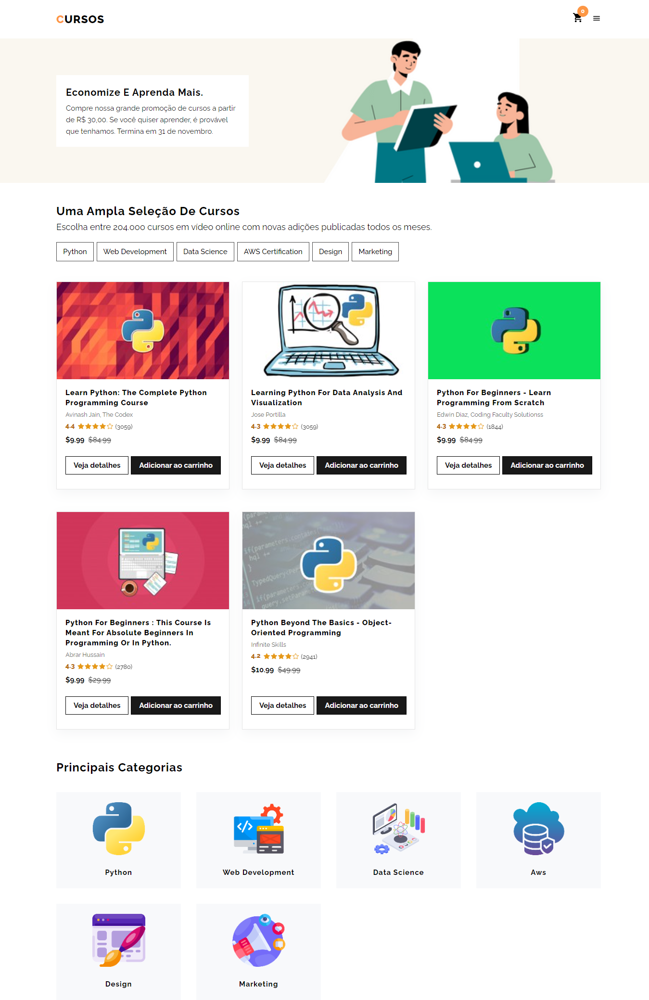

## :movie_camera: **Demonstração**

<p align="center">
  <b> :computer: WEB </b>
</p>

<p align="center">
  <kbd>
    
  </kbd>
</p>

## :dvd: **Executar**

Para executar esse projeto você precisa clonar ou [`baixar`](https://github.com/rafaelfachinelli/DSVendas/archive/main.zip) este repositório, ter o Gerenciador de Pacotes do Node ([`NPM`](https://www.npmjs.com/get-npm)) ou o Gerenciador de Pacotes YARN ([`YARN`](https://yarnpkg.com/getting-started)) instalado.

### :globe_with_meridians: **Frontend**

<details>
  <summary><i>with <b>npm</b></i></summary>
  
  ```bash
  # Instalar dependências
  $ npm install

  # Iniciar servidor de desenvolvimento
  $ npm start
  ```
  
</details>

### [](https://github.com/driica/#--autor) 💎 Autora 


## :page_facing_up: **Licença**

<div align="center">
  
<p>Copyright © 2022 <strong>Adriana Beatriz.</strong></p>

</div>
